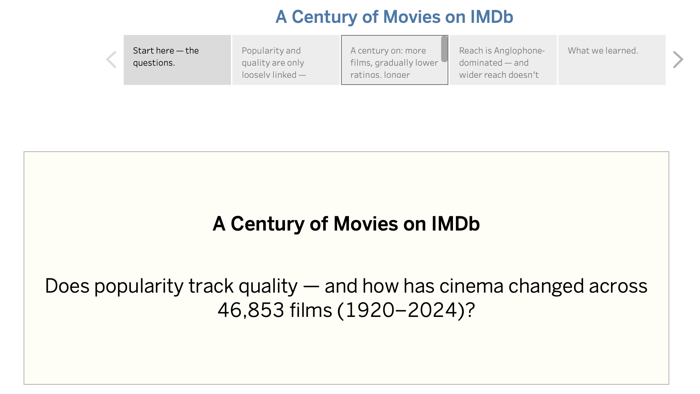
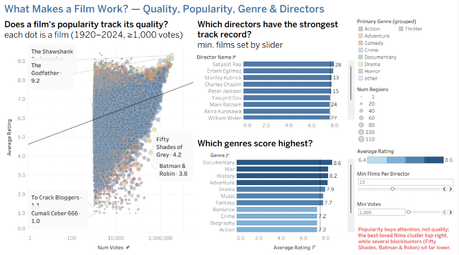
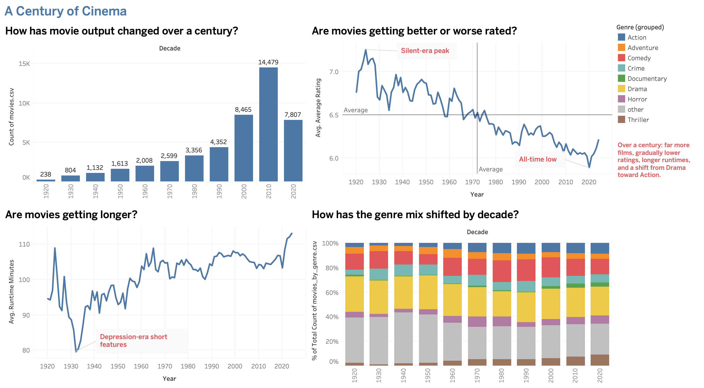
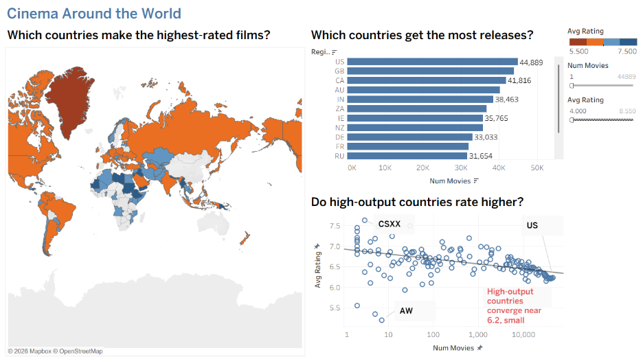

# A Century of Movies on IMDb

An interactive Tableau system that explores 46,853 feature films (1920 to 2024) from the official IMDb datasets: how popularity relates to quality, how cinema changed over a century, which genres and directors stand out, and where films are released around the world.

**Live version:** [Tableau Public](https://public.tableau.com/app/profile/mohamad.shalata/viz/Final_Version_17913062407830/CinemaAroundtheWorld)

## The questions

- Does popularity track quality?
- Which films are acclaimed but obscure, and which are popular but weak?
- Which genres and directors earn the highest ratings over a real body of work?
- How have output, ratings, runtime and the genre mix changed by decade?
- Where in the world are films released, and does wider reach mean higher ratings?

## The system

Three linked dashboards and a guided story, with linking and brushing, filter and highlight actions, live parameters, and custom tooltips.

| Dashboard | Main views |
| --- | --- |
| What Makes a Film Work? | Votes (log) against rating scatter, top directors, genre ratings |
| A Century of Cinema | Films per decade, rating and runtime over time, genre mix by decade |
| Cinema Around the World | Choropleth map with a diverging palette, top regions, reach against rating |

## Key findings

- **Popularity and quality are only loosely linked** (Pearson r ≈ 0.24 between log-votes and rating). The insight lives in the corners of the scatter.
- **Prestige and non-fiction genres rate highest** (Documentary about 7.2), while Sci-Fi and Horror sit lowest (about 5.4 and 5.2).
- **Output grew from 238 films in the 1920s to 14,479 in the 2010s**, while average ratings slid from about 7.3 to about 6.0, largely a survivorship effect.
- **Releases concentrate in the Anglophone world**, and wider reach brings no rating dividend (region-level r ≈ -0.22).

## Data and preprocessing

Source: [IMDb Non-Commercial Datasets](https://datasets.imdbws.com/), five files joined on title and person IDs (`title.basics`, `title.ratings`, `title.crew`, `name.basics`, `title.akas`).

The raw files hold millions of rows, so they were reduced with a Python (pandas) pipeline, using `awk` and `zcat` to stream the largest files:

- Kept feature films released between 1920 and 2024.
- Kept films with at least 1,000 votes, reducing about 592,000 titles to 46,853.
- Attached the primary director and counted distinct release regions per film.
- Built a long movie-genre table (109,161 rows) and a region summary (165 rows).

## Repository contents

- `imdb_century_of_cinema.twbx`: the packaged Tableau workbook, including the data extracts. Open it with Tableau Public Desktop.
- `images/`: screenshots of the story and dashboards.

## Roadmap

- [ ] Republish the workbook on my own Tableau Public profile and update the live link.
- [ ] Add the preprocessing pipeline as a reproducible Python script.
- [ ] Add a short write-up of the design choices (encodings, color, interaction).

## About

Developed as the final project of the Data Visualization course in the B.Sc. in Information Systems, University of Haifa, 2026.
